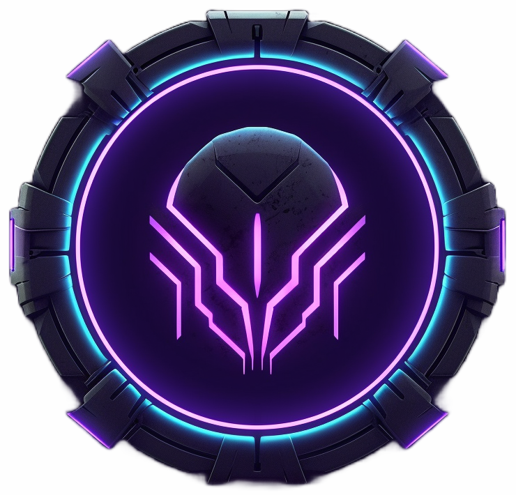

  
  <h3 align="center"><b>Sign-up Form</b></h3>
  

    For an enigmatic brand, Ascension Cybernetics™
     
     
    <a href="https://weissey.github.io/Ascension-Sign-Up-Form/">View Demo</a>
    ·
    <a href="https://github.com/Weissey/Ascension-Sign-Up-Form/issues">Report Bugs</a>
    ·
    <a href="https://github.com/Weissey/Ascension-Sign-Up-Form/issues">Request Features</a>
  

<!-- PROJECT -->
## Built with:
- 
-    
- 

 

## Tools Used

-    
-   
-   

 

## Key Features

- Developed using **modern JavaScript** techniques
- Effectively **evaluates form input** with essential validation
- Offers an **optimized UI** and **UX** experience
- **Responsive design** for both **Desktop** and **Mobile** devices

 

## Project Outcomes

- Utilized HTML5 **semantic elements** for enhanced readability and structure
- Employed CSS3 **flexbox** for layout management
- Leveraged **Git** and **GitHub** for efficient project management
- Strived to maintain **clean and organized code**
- **Cross-browser tested** on Firefox and Chromium-based browsers

 

## Lessons Learned

- Form handling in JavaScript
- Ternary operator proficiency
- Valuable minor skills and insights

 

<!-- ACKNOWLEDGMENTS -->
## Acknowledgments

- Inspired by [The Odin Project](https://www.theodinproject.com/)
- Illustrative vectors courtesy of [Storyset](https://www.storyset.com/)

 

<!-- LICENSE -->
## License

- Released under the MIT License. Refer to the `LICENSE` file for details.

 

<!-- CONTACT -->
## Author

